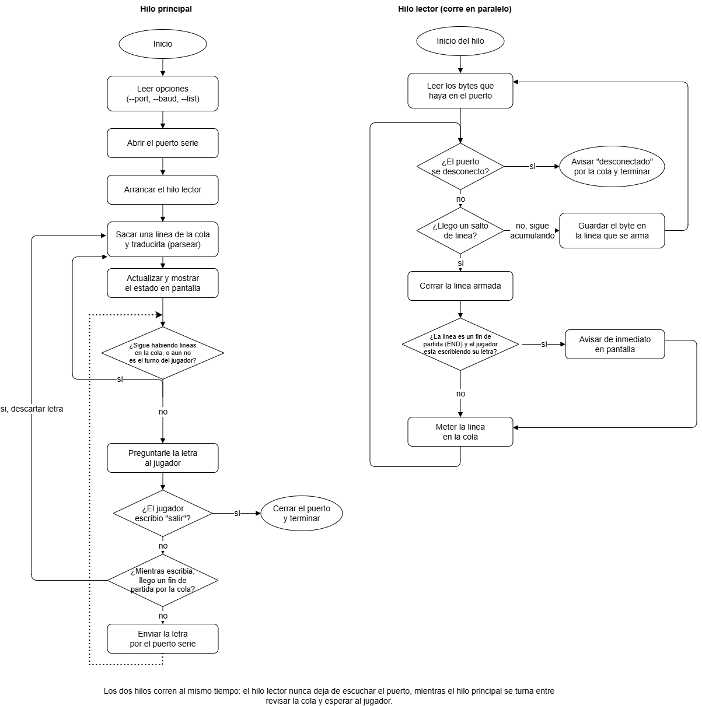

# Defensa Escrita — Terminal del Jugador (`ahorcado_terminal.py`)

**Proyecto:** EL3313 — Taller de Diseño Digital, Proyecto 2 (Ahorcado FPGA/PC)
**Componente:** Aplicación de PC (lado software) del enlace serie

---

## 1. Rol dentro del sistema completo

Este programa es el lado **PC** del enlace serie cuyo lado **FPGA** es el periférico UART del proyecto. No implementa ninguna regla del juego: el banco de palabras, la lógica de aciertos/fallos y el límite de tiempo viven en la FPGA. La terminal cumple exactamente dos tareas:

1. Traducir la letra que escribe la persona a un byte y mandarlo por el puerto serie.
2. Traducir las líneas de texto que manda la FPGA a algo legible en pantalla.

Esta separación de responsabilidades (PC = interfaz humana, FPGA = lógica del juego) es la primera decisión de diseño que hay que poder defender: si alguien pregunta "¿por qué no valida la letra la FPGA?" o "¿por qué no decide el resultado la PC?", la respuesta es que el enunciado del proyecto exige que el juego corra en hardware; la PC es solo el teclado y la pantalla que la FPGA no tiene.

---

## 2. Protocolo de comunicación serie

**PC → FPGA:** un solo byte por turno, una letra ASCII de la `A` a la `Z`.

**FPGA → PC:** líneas de texto terminadas en `\n`, con campos de **ancho fijo**:

| Línea | Formato exacto | Largo total | Campos |
|---|---|---|---|
| `START` | `START:<M>:<LL>` | 10 | `M` = `F`/`D` (modo), `LL` = longitud en 2 dígitos |
| `PATT` | `PATT:
` | variable | `p` = patrón con `_` en lo oculto |
| `LET` | `LET:<X>:<R>` | 9 | `X` = letra jugada, `R` = `OK `/`NO `/`RPT` |
| `ERR` | `ERR:<n>` | 5 | `n` = un dígito, intentos restantes |
| `END` | `END:<E>:<W>` | variable, >8 | `E` = `WIN`/`LER`/`LTO`, `W` = palabra completa |

**Por qué ancho fijo y no expresiones regulares:** la FPGA arma los mensajes con lógica de registros/temporizadores fija, no con un motor de texto. Es mucho más barato (en lógica y en tiempo de diseño) generar campos de ancho constante que una gramática variable. Del lado de Python, `parsear()` explota esto: primero valida el largo exacto y solo después corta por posición (`linea[6]`, `linea[8:10]`, etc.), lo que evita procesar basura a medias.

---

## 3. Arquitectura general (Diagrama 1)

El diagrama general divide el programa en seis bloques funcionales. Aquí está la correspondencia exacta con el código:

| Bloque del diagrama | Función/objeto real | Lo que hace |
|---|---|---|
| `main` | `main()` (líneas 362–429) | Lee opciones de línea de comandos, abre el puerto serie, crea la cola y el `Event`, arranca el hilo lector, llama a `jugar()` |
| `lector` | `lector()` (líneas 134–180) | Hilo aparte; lee bytes del puerto, arma líneas por posición del `\n` |
| `Cola` | `queue.Queue()` | Bandeja FIFO thread-safe entre `lector` y `jugar` |
| `Interpretar` | `parsear()` (líneas 75–128) | Convierte una línea de texto en `(tipo, datos)` o `None` |
| `Estado` | clase `Estado` (líneas 186–213) | Guarda el último patrón, intentos y última letra jugada |
| `jugar` | `jugar()` (líneas 267–358) | Ciclo principal: alterna entre vaciar la cola y pedir letra |
| `pedir_letra` | `pedir_letra()` (líneas 219–263) | Pregunta y valida la letra en un bucle |

El flujo de datos es unidireccional en cada sentido: los bytes que llegan del puerto solo pueden entrar al programa por `lector`, y solo pueden salir hacia el puerto desde `jugar` (después de pasar por `pedir_letra`). No hay ningún otro punto de acceso al puerto serie, lo cual es importante para defender que no hay condiciones de carrera sobre el objeto `puerto`: un hilo solo lee (`puerto.read`), el otro solo escribe (`puerto.write`).

---

## 4. Recorrido del hilo lector (columna derecha del Diagrama 2)

Paso a paso, contra el código real:

1. **Leer los bytes que haya** → `puerto.read(puerto.in_waiting or 1)` (línea 152). El `or 1` evita un ciclo vacío cuando no hay nada esperando: siempre se intenta leer al menos un byte, y el `timeout=0.2` del puerto (línea 400) evita que esa lectura se quede bloqueada para siempre.
2. **¿Se desconectó?** → el `try/except` (líneas 149–157) captura cualquier excepción de `read` (cable desconectado, puerto cerrado) y mete `("desconectado", ...)` en la cola, terminando el hilo con `return`.
3. **¿Llegó un salto de línea (`0x0A`)?** → línea 160. Si no, el byte se acumula en `buffer` (línea 175), salvo que sea un retorno de carro `0x0D`, que se ignora (línea 172) — esto es lo que permite que el programa funcione igual si la FPGA manda `\r\n` o solo `\n`.
4. **Cerrar la línea armada** → `buffer.decode(...)` y `buffer.clear()` (líneas 163–164).
5. **¿Es `END` y el jugador está escribiendo?** → línea 165, usando `esperando_letra.is_set()`. Si es cierto, se imprime el aviso inmediato (líneas 169–170) **antes** de tocar la cola.
6. **Meter la línea en la cola** → línea 171, esto pasa siempre, haya habido aviso inmediato o no.

Una guarda adicional que no aparece explícita en el diagrama pero vale la pena mencionar en la defensa: si el `buffer` supera 80 caracteres sin cerrar (línea 176), se descarta por completo. Es la protección contra ruido eléctrico en la línea serie que nunca manda un `\n`.

---

## 5. Recorrido del hilo principal (columna izquierda del Diagrama 2)

1. **Leer opciones / abrir puerto / arrancar hilo lector** → `main()`, líneas 373–416.
2. **Sacar una línea de la cola y traducirla** → `tipo, datos = cola.get()` seguido de `parsear(datos["texto"])` (líneas 284–290).
3. **Actualizar y mostrar el estado** → el bloque `if/elif` por `clase` (líneas 298–338) actualiza los campos de `estado`; el llamado real a `estado.mostrar()` solo ocurre para los eventos `"letra"` con resultado `RPT` (línea 318) y para `"intentos"` (línea 327), que es el último dato de una jugada normal. Los eventos `"inicio"` y `"fin"` imprimen su propio mensaje en vez de usar `estado.mostrar()`.
4. **¿Sigue habiendo líneas en la cola, o aún no es turno?** → condición del `while` externo, `while not turno or not cola.empty()` (línea 283).
5. **Preguntar la letra** → `pedir_letra(esperando_letra)` (línea 341).
6. **¿Escribió "salir"?** → en el diagrama esta pregunta agrupa dos caminos del código: escribir literalmente `salir` (línea 244) y presionar `Ctrl+D`/`Ctrl+C` durante el `input()` (líneas 232–234, `EOFError`/`KeyboardInterrupt`). Ambos casos devuelven `None` desde `pedir_letra`, y `jugar()` los trata igual (línea 342).
7. **¿Llegó un fin de partida mientras escribía?** → esta es la condición `if not cola.empty() or not en_partida` (línea 349). Ver la aclaración en la sección 8: cubre dos casos, no solo uno.
8. **Enviar la letra** → `puerto.write(letra.encode("ascii"))` (línea 354), dentro de su propio `try/except` por si el puerto se cae justo en ese instante.
9. **Volver al inicio del ciclo** → `turno = False` (líneas 350 y 358) antes de volver a evaluar la cola.

---

## 6. Decisiones de diseño y su justificación

Esta sección es el núcleo de la defensa: cada decisión no obvia, con su razón.

- **Un hilo aparte para leer (`threading.Thread`, línea 413–416):** el límite de tiempo corre en la FPGA, no en la PC. Si la lectura fuera síncrona (leer solo entre pregunta y pregunta), un `END` por tiempo agotado no se vería hasta que el jugador terminara de escribir, que es tarde. El hilo lector nunca deja de escuchar.
- **`queue.Queue` como frontera entre hilos:** es la estructura estándar de Python para comunicación productor-consumidor thread-safe; evita tener que programar candados (`locks`) a mano.
- **`threading.Event` (`esperando_letra`):** es la señal mínima que necesita el hilo lector para saber si vale la pena avisar de inmediato. Se marca justo antes del `input()` (línea 229) y se limpia en un `finally` (líneas 236–238) para que quede en `False` sin importar por qué camino se salió de la espera (letra válida, `salir`, o `Ctrl+C`).
- **Descartar en vez de fallar ante una línea rara (`parsear()` devuelve `None`):** el enlace serie puede tener ruido o desincronizarse un byte. Es preferible perder una línea y avisar en pantalla (línea 293) que detener todo el programa.
- **`daemon=True` en el hilo lector (línea 415):** así, si el hilo principal termina, el proceso completo puede cerrar sin quedar colgado esperando a que el hilo lector también termine por su cuenta.
- **`timeout=0.2` al abrir el puerto (línea 400):** sin esto, `puerto.read()` podría bloquear indefinidamente si la FPGA deja de mandar datos, dejando el hilo lector sin poder revisar si el puerto sigue vivo.
- **Descartar la letra si ya no hay partida activa (línea 349):** enviar un byte cuando la partida ya terminó (o cuando todavía no ha empezado) no tiene destino útil en la FPGA; es más limpio no mandarlo que confiar en que el hardware lo ignore.
- **Validación estricta A–Z sin tildes ni Ñ (líneas 253–261):** el banco de palabras de la FPGA solo usa ese alfabeto; mandar un byte fuera de rango se descartaría en silencio del lado hardware, así que es mejor detectarlo en la PC y pedirle al jugador que corrija.

---

## 7. Aclaraciones para la defensa oral (simplificaciones de los diagramas)

Los diagramas son correctos como representación conceptual, pero simplifican dos puntos que conviene tener listos si el jurado pregunta por el detalle exacto:

1. **"escribe byte" en el Diagrama 1:** la flecha sale visualmente del bloque `pedir_letra` hacia `Puerto serie`. En el código, `pedir_letra()` solo *devuelve* la letra validada; quien realmente llama a `puerto.write()` es `jugar()` (línea 354), después de comprobar que la partida sigue activa. El diagrama general agrupa "pedir + enviar" como un solo flujo funcional porque conceptualmente pertenecen al mismo turno del jugador.
2. **"¿Mientras escribía llegó un fin de partida por la cola?" en el Diagrama 2:** la condición real del código (`not cola.empty() or not en_partida`, línea 349) cubre **dos** casos, no uno: (a) llegó un `END` mientras el jugador escribía, y (b) el jugador escribió una letra sin que hubiera ninguna partida en curso todavía (por ejemplo, antes de que la FPGA mande el primer `START`). El diagrama nombra solo el caso (a) porque es el más relevante para explicar la concurrencia, pero el (b) es el que evita mandar letras "al vacío" al arrancar el programa.

Ninguna de las dos es un error: son abstracciones razonables para un diagrama de bloques. Lo importante es poder explicar la diferencia si alguien compara el diagrama línea por línea contra el código.

---

## 8. Preguntas esperadas del jurado y respuestas sugeridas

**¿Por qué no usar expresiones regulares para `parsear()`?**
Porque los campos son de ancho fijo por diseño del protocolo; cortar por posición es más simple, más rápido y más fácil de verificar que compilar una gramática para un formato que no la necesita.

**¿Qué pasa si dos letras llegan pegadas en el mismo `read()`?**
No pasa nada especial: el `for byte in datos` (línea 159) procesa byte por byte dentro del mismo `read()`, así que aunque lleguen varias líneas juntas en un solo bloque de datos, cada una se cierra y se encola por separado en cuanto aparece su propio `\n`.

**¿Por qué la cola y no variables compartidas protegidas con un candado?**
`queue.Queue` ya es thread-safe internamente; usarla evita escribir y mantener sincronización manual, y es el patrón productor-consumidor recomendado en la biblioteca estándar de Python para este caso exacto (un productor, un consumidor).

**¿Qué pasa si el jugador escribe una letra justo cuando termina la partida?**
Se descarta sin enviarse (línea 349-351): se prioriza no mandar datos huérfanos sobre no "desperdiciar" lo que el jugador ya escribió.

**¿Por qué `daemon=True` en el hilo lector?**
Para que el proceso pueda cerrar limpiamente aunque el hilo lector esté bloqueado en una lectura del puerto en ese instante; no se necesita esperar a que termine por su cuenta.

**¿Qué asegura que no se rompa el programa si llega basura por el puerto?**
Tres capas: el `try/except` en `lector()` para errores de I/O, la comprobación de largo exacto dentro de `parsear()` para líneas mal formadas, y el descarte de buffers de más de 80 caracteres para líneas que nunca cierran.

---

## 9. Conclusión

`ahorcado_terminal.py` es intencionalmente delgado: no toma ninguna decisión de juego, solo traduce en los dos sentidos con un protocolo de ancho fijo que hace el análisis trivial, y usa un hilo separado exclusivamente para no perder avisos de tiempo agotado mientras el jugador escribe. Cada estructura de concurrencia (hilo, cola, `Event`) responde a un problema puntual y verificable, no a una preferencia de estilo — eso es lo que hay que poder mostrar en la defensa: que cada pieza está ahí porque resuelve algo concreto, no porque "así se hace".

---

